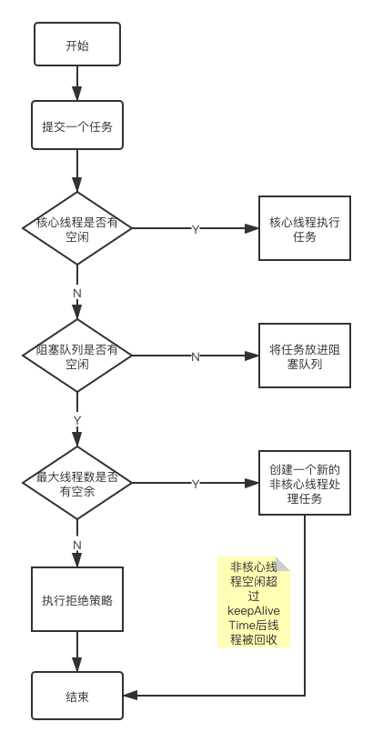

# 线程池

### 工作流程

首先看下创建线程池的类 `ThreadPoolExecutor`

    public ThreadPoolExecutor(int corePoolSize, int maximumPoolSize,long keepAliveTime,TimeUnit unit,
       BlockingQueue<Runnable> workQueue,
       ThreadFactory threadFactory,
       RejectedExecutionHandler handler);

- corePoolSize，核心线程数
- maximumPoolSize，最大线程数
- keepAliveTime，非核心线程数的存活时间
- unit，非核心线程数存活时间的单位
- workQueue，存放任务的阻塞队列
- threadFactory，线程创建工厂，可以给线程命名
- handler，拒绝策略

线程池的工作流程：

1. 提交一个任务，线程池里存活的核心线程数小于线程数 corePoolSize 时，线程池会创建一个核心线程去处理提交的任务。
2. 如果线程池核心线程数已满，即线程数已经等于 corePoolSize ，新提交的任务会被放进任务队列 workQueue 排队等待执行。
3. 当线程池里面存活的线程数已经等于 corePoolSize 了,并且任务队列 workQueue 也满，判断线程数是否达到 maximumPoolSize，即最大线程数是否已满，如果没到达，创建一个非核心线程执行提交的任务。
4. 如果当前的线程数达到了 maximumPoolSize，还有新的任务过来的话，直接采用拒绝策略处理。

### 阻塞队列类型

- ArrayBlockingQueue

    数组，有界，FIFO

- LinkedBlockingQueue

    链表，可设置容量（如果不设置，无界，长度最大为 `Integer.MAX_VALUE`）， FIFO。

- DelayQueue

    无界，延时队列

- PriorityBlockingQueue

    无界，有优先级

- SynchronousQueue

    一个不存储元素的阻塞队列，每个插入操作必须等到另一个线程调用移除操作，否则插入操作一直处于阻塞状态

### 常用线程池

上面介绍完 `ThreadPoolExecutor` 的所有参数，其实日常使用中，我们常常用到 `Executors` 的静态方法创建线程池。原理其实就是根据线程池类型提供了构造 `ThreadPoolExecutor` 的快速方法，类型可以分为以下四种。

- newFixedThreadPool (固定数目线程的线程池)
- newCachedThreadPool(可缓存线程的线程池)
- newSingleThreadExecutor(单线程的线程池)
- newScheduledThreadPool(定时及周期执行的线程池)

**newFixedThreadPool**

    public static ExecutorService newFixedThreadPool(int nThreads, ThreadFactory threadFactory) {
    	return new ThreadPoolExecutor(nThreads, nThreads,
    	                              0L, TimeUnit.MILLISECONDS,
    	                              new LinkedBlockingQueue<Runnable>(),
    	                              threadFactory);
    }

它的工作线程只有核心线程，因为最大线程数就是核心线程数。同时也可能因为任务的执行时间较长，引起阻塞队列很大，任务堆积严重，内存飙升。

**newCachedThreadPool**

    public static ExecutorService newCachedThreadPool(ThreadFactory threadFactory) {
    	return new ThreadPoolExecutor(0, Integer.MAX_VALUE,
    	                              60L, TimeUnit.SECONDS,
    	                              new SynchronousQueue<Runnable>(),
    	                              threadFactory);
    }

核心线程数为0，最大线程数为`Integer.MAX_VALUE`，阻塞队列为 `SynchronousQueue`，非核心线程存活时间为60s。

当提交任务的速度大于处理任务的速度时，没提交一个任务都会新建一个线程，所以会导致线程数过多，消耗CPU和内存资源。所以它适用于高并发，任务处理快的场景。

**newSingleThreadExecutor**

    public static ExecutorService newSingleThreadExecutor(ThreadFactory threadFactory) {
    	return new FinalizableDelegatedExecutorService
    	    (new ThreadPoolExecutor(1, 1,
    	                            0L, TimeUnit.MILLISECONDS,
    	                            new LinkedBlockingQueue<Runnable>(),
    	                            threadFactory));
    }

核心线程数 = 最大线程数 = 1，阻塞队列 `LinkedBlockingQueue`，keepAliveTime 为 0。始终只有一个线程在处理任务，适用于任务串行执行。

**newScheduledThreadPool**

    public static ScheduledExecutorService newScheduledThreadPool(
    			int corePoolSize, ThreadFactory threadFactory) {
    	return new ScheduledThreadPoolExecutor(corePoolSize, threadFactory);
    }
    
    public ScheduledThreadPoolExecutor(int corePoolSize,
          ThreadFactory threadFactory) {
    	super(corePoolSize, Integer.MAX_VALUE, 0, NANOSECONDS,
              new DelayedWorkQueue(), threadFactory);
    }

最大线程数是 `Integer.MAX_VALUE`，阻塞队列为 `DelayedWorkQueue`，keepAliveTime 为 0。

- 添加一个任务
- 线程池中的线程从 `DelayQueue` 中取任务
- 线程从 `DelayQueue` 中获取 time 大于等于当前时间的task
- 执行完后修改这个 task 的 time 为下次被执行的时间
- 这个 task 放回 `DelayQueue` 队列中

### **线程池生命周期**

**RUNNING**

- 该状态的线程池会接收新任务，并处理阻塞队列中的任务;
- 调用线程池的 `shutdown()` 方法，可以切换到 SHUTDOWN 状态;
- 调用线程池的 `shutdownNow()` 方法，可以切换到 STOP 状态;

**SHUTDOWN**

- 该状态的线程池不会接收新任务，但会处理阻塞队列中的任务；
- 队列为空，并且线程池中执行的任务也为空,进入 TIDYING 状态;

**STOP**

- 该状态的线程不会接收新任务，也不会处理阻塞队列中的任务，而且会中断正在运行的任务；
- 线程池中执行的任务为空,进入 TIDYING 状态;

**TIDYING**

- 该状态表明所有的任务已经运行终止，记录的任务数量为0。
- `terminated()` 执行完毕，进入TERMINATED状态

**TERMINATED**

- 该状态表示线程池彻底终止

### 拒绝策略

当线程池的任务缓存队列已满并且线程池中的线程数目达到 maximumPoolSize 时，如果还有任务到来就会采取任务拒绝策略。

- ThreadPoolExecutor.AbortPolicy

    【默认策略】丢弃任务并抛出 `RejectedExecutionException` 异常。

- ThreadPoolExecutor.DiscardPolicy

    丢弃任务，但是不抛出异常。

- ThreadPoolExecutor.DiscardOldestPolicy

    丢弃队列最前面的任务，然后重新提交被拒绝的任务。

- ThreadPoolExecutor.CallerRunsPolicy

    由调用线程（提交任务的线程）处理该任务。